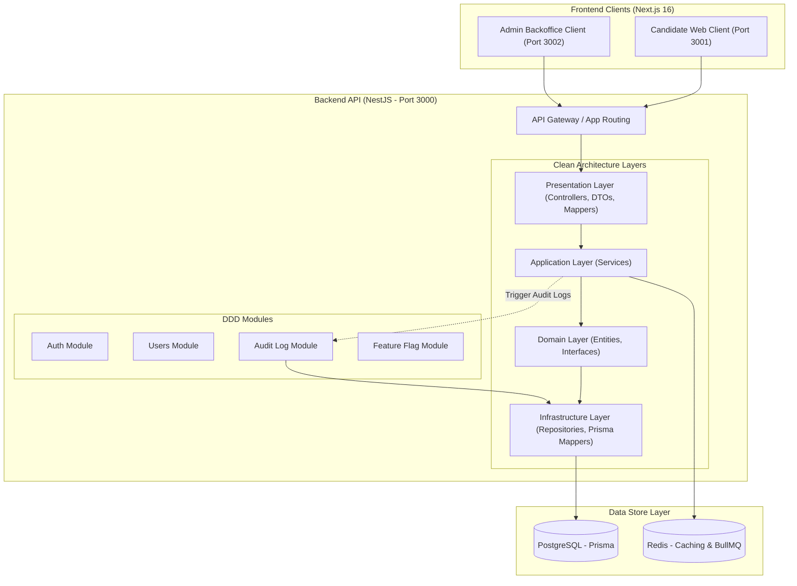

# ElevateSDE

ElevateSDE is an enterprise-grade AI-driven interview preparation platform built as a SaaS product. It supports candidates preparing for interviews through timed assessments, real-time AI-driven mock interviews, and personalized learning plans.

## Documentation

- **Architecture:** Detailed technical stack, monorepo structure, DDD pattern, database schemas, and advanced systems are documented in [architecture.md](file:///Users/rizonkumarrahi/Developer/elevateSDE/architecture.md).
- **Developer Guidelines:** Guidelines for development, coding standards (no comments), git branching strategy, and UI rules for AI assistants are documented in [gemini.md](file:///Users/rizonkumarrahi/Developer/elevateSDE/gemini.md).

## System Architecture Diagram



## System Audit Logging & Compliance

Audit Logs are implemented to track administrative actions, mutations, and authentication occurrences across the system. We require audit logging for:

1. **Security Compliance:** Fulfilling standards such as SOC 2 and ISO 27001 by maintaining an immutable trail of administrative actions.
2. **Accountability:** Tracking details on critical mutations (such as user role adjustments, tenant upgrades, or subscription modifications).
3. **Troubleshooting & Debugging:** Enabling developers and B2B managers to reconstruct chronological sequences of events when debugging system states.

## Monorepo Workspace Structure

````text
├── elevatesde/
│   ├── apps/
│   │   ├── web/                 (Next.js 16.2.9 Frontend - Candidate Portal)
│   │   ├── api/                 (NestJS Backend - Core API)
│   │   └── admin/               (Next.js 16.2.9 Frontend - Admin Backoffice)
│   ├── packages/
│   │   ├── shared-types/        (TypeScript Interfaces used across apps)
│   │   ├── ui/                  (Shared Tailwind components)
│   │   ├── eslint-config/       (Standardized linting)
│   │   ├── ts-config/           (Standardized TypeScript rules)
│   │   └── logger/              (Custom Winston + OpenTelemetry wrapper)

## Getting Started

To run the applications in development, use the following commands from any directory in the workspace:

* **Run all applications** (API + Web Client + Admin Backoffice):
  ```bash
  pnpm -w run dev:all
````

- **Run only the client frontends** (Web Client + Admin Backoffice):
  ```bash
  pnpm -w run dev:clients
  ```
- **Run type checks**:
  ```bash
  pnpm -w run type-check
  ```
- **Run linter**:
  ```bash
  pnpm -w run lint
  ```
- **Run build**:
  ```bash
  pnpm -w run build
  ```

```

```
