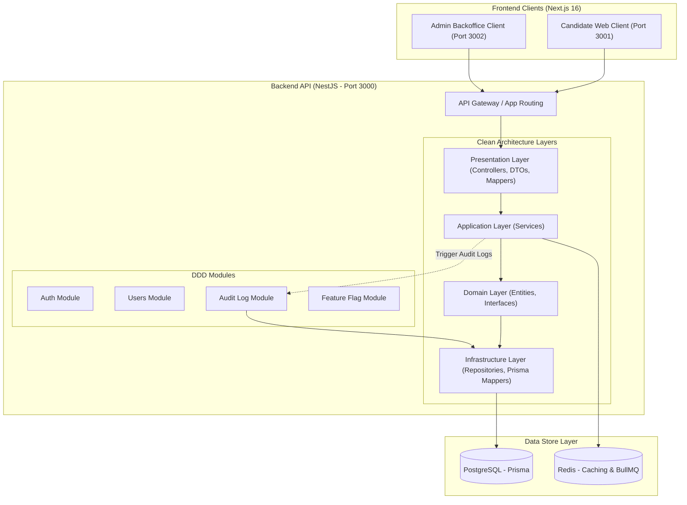

# ElevateSDE

ElevateSDE is an enterprise-grade AI-driven interview preparation platform built as a SaaS product. It supports candidates preparing for interviews through timed assessments, real-time AI-driven mock interviews, and personalized learning plans.

## Documentation

- **Architecture:** Detailed technical stack, monorepo structure, DDD pattern, database schemas, and advanced systems are documented in [architecture.md](./architecture.md).
- **Developer Guidelines:** Guidelines for development, coding standards (no comments), git branching strategy, and UI rules for AI assistants are documented in [Claude.md](./Claude.md).

## System Architecture Diagram



## System Audit Logging & Compliance

Audit Logs are implemented to track administrative actions, mutations, and authentication occurrences across the system. We require audit logging for:

1. **Security Compliance:** Fulfilling standards such as SOC 2 and ISO 27001 by maintaining an immutable trail of administrative actions.
2. **Accountability:** Tracking details on critical mutations (such as user role adjustments, tenant upgrades, or subscription modifications).
3. **Troubleshooting & Debugging:** Enabling developers and B2B managers to reconstruct chronological sequences of events when debugging system states.

## Monorepo Workspace Structure

```text
elevatesde/
├── apps/
│   ├── web/                 (Next.js 16.2.9 Frontend - Candidate Portal, port 3001)
│   ├── api/                 (NestJS Backend - Core API, port 4400)
│   └── admin/               (Next.js 16.2.9 Frontend - Admin Backoffice, internal port 3002, served at /admin)
├── packages/
│   ├── shared-types/        (TypeScript Interfaces used across apps)
│   ├── ui/                  (Shared Tailwind components)
│   ├── eslint-config/       (Standardized linting)
│   ├── ts-config/           (Standardized TypeScript rules)
│   └── logger/              (Custom Winston + OpenTelemetry wrapper)
```

## Local Setup

The API requires a PostgreSQL database (and Redis for caching/queues). Both are described in `docker-compose.yml`, or you can point at a locally running instance.

1. **Install dependencies** (from the repo root):

   ```bash
   pnpm install
   ```

2. **Create environment files** from the provided examples:

   - `apps/api/.env` — copy from `apps/api/.env.example` and set `DATABASE_URL`, `JWT_SECRET`, `PORT` (default `4400`).
   - `apps/web/.env.local` and `apps/admin/.env.local` — copy from their `.env.example` siblings and set `NEXT_PUBLIC_API_URL` to match the API URL (default `http://localhost:4400`).

   > If port `4400` is already in use, set a free `PORT` in `apps/api/.env` and update `NEXT_PUBLIC_API_URL` in both client `.env.local` files to match.

3. **Start the database & cache** (via Docker, or use a local Postgres/Redis):

   ```bash
   docker compose up -d
   ```

4. **Apply migrations and seed demo data** (from `apps/api`):

   ```bash
   pnpm exec prisma generate
   pnpm exec prisma migrate deploy
   pnpm exec prisma db seed
   ```

5. **Run the apps**:

   ```bash
   pnpm -w run dev:all
   ```

## Dashboards

| Surface | URL | Access |
| --- | --- | --- |
| Candidate dashboard | `http://localhost:3001/dashboard` | Any authenticated user |
| Organization dashboard | `http://localhost:3001/dashboard/org` | `TENANT_ADMIN` only |
| Super-Admin backoffice | `http://localhost:3001/admin` | `ADMIN` only |

> Everything is reached through the single web origin on **port 3001**. The backoffice is a separate Next.js app (`apps/admin`) that runs internally on port `3002` with `basePath: '/admin'`; `apps/web/next.config.ts` rewrites `/admin/:path*` to it, so you always visit `localhost:3001/admin` (a reverse proxy does the same under one domain in production). Do not open port `3002` directly.

Seeded demo logins (all use the password `Password123!`):

| Email | Role |
| --- | --- |
| `admin@elevatesde.dev` | `ADMIN` |
| `org@elevatesde.dev` | `TENANT_ADMIN` |
| `candidate@elevatesde.dev` | `USER` |

The candidate and organization dashboards are driven by typed client-side stores (mock data) since their backing domain models are not yet implemented; the backoffice consumes live `/api/v1/admin/*` endpoints.

## Common Commands

```bash
pnpm -w run dev:all       # API + Web Client + Admin Backoffice
pnpm -w run dev:clients   # Web Client + Admin Backoffice only
pnpm -w run type-check    # TypeScript checks across the workspace
pnpm -w run lint          # ESLint across the workspace
pnpm -w run build         # Build all apps and packages
```
