# ElevateSDE

ElevateSDE is an enterprise-grade AI-driven interview preparation platform built as a SaaS product. It supports candidates preparing for interviews through timed assessments, real-time AI-driven mock interviews, and personalized learning plans.

## Documentation

- **Architecture:** Detailed technical stack, monorepo structure, DDD pattern, database schemas, and advanced systems are documented in [architecture.md](./architecture.md).
- **Developer Guidelines:** Guidelines for development, coding standards (no comments), git branching strategy, and UI rules for AI assistants are documented in [CLAUDE.md](./CLAUDE.md).

## System Architecture Diagram

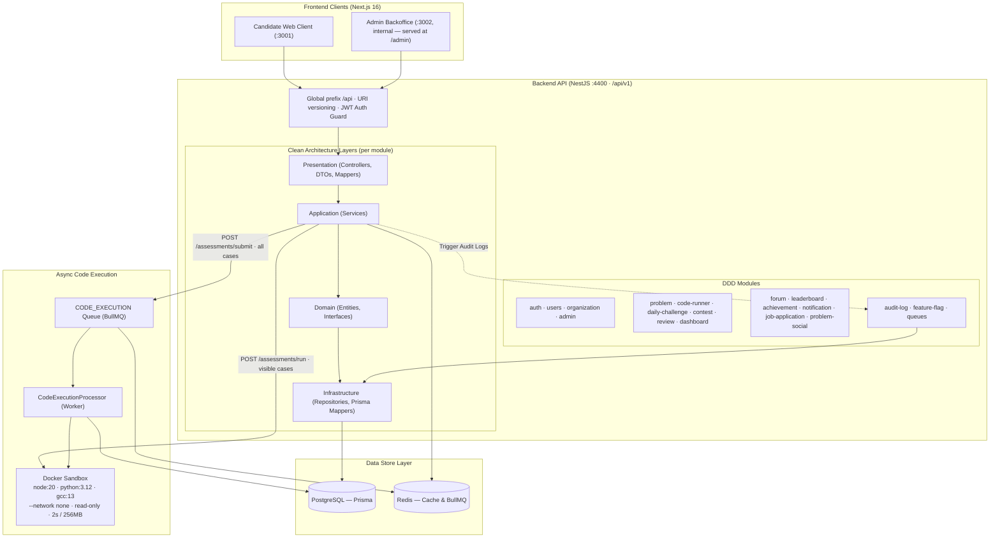
```mermaid
graph TD
    subgraph Clients["Frontend Clients (Next.js 16)"]
        Web["Candidate Web Client (:3001)"]
        Admin["Admin Backoffice (:3002, internal — served at /admin)"]
    end

    subgraph API["Backend API (NestJS :4400 · /api/v1)"]
        Gateway["Global prefix /api · URI versioning · JWT Auth Guard"]

        subgraph Domains["DDD Modules"]
            CoreMods["auth · users · organization · admin"]
            LearnMods["problem · code-runner · daily-challenge · contest · review · dashboard"]
            CommMods["forum · leaderboard · achievement · notification · job-application · problem-social"]
            PlatMods["audit-log · feature-flag · queues"]
        end

        subgraph Layers["Clean Architecture Layers (per module)"]
            Pres["Presentation (Controllers, DTOs, Mappers)"]
            App["Application (Services)"]
            Dom["Domain (Entities, Interfaces)"]
            Infra["Infrastructure (Repositories, Prisma Mappers)"]
        end
    end

    subgraph Async["Async Code Execution"]
        Queue["CODE_EXECUTION Queue (BullMQ)"]
        Worker["CodeExecutionProcessor (Worker)"]
        Sandbox["Docker Sandbox<br/>node:20 · python:3.12 · gcc:13<br/>--network none · read-only · 2s / 256MB"]
    end

    subgraph Storage["Data Store Layer"]
        DB[("PostgreSQL — Prisma")]
        Cache[("Redis — Cache & BullMQ")]
    end

    Web --> Gateway
    Admin --> Gateway
    Gateway --> Pres
    Pres --> App
    App --> Dom
    Dom --> Infra
    Infra --> DB
    App --> Cache

    %% Code execution: synchronous run vs queued submit
    App -->|POST /assessments/run · visible cases| Sandbox
    App -->|POST /assessments/submit · all cases| Queue
    Queue --> Cache
    Queue --> Worker
    Worker --> Sandbox
    Worker --> DB

    %% Audit Logging Hook
    App -.->|Trigger Audit Logs| PlatMods
    PlatMods --> Infra
```

## Screenshots

Every image below adapts to your GitHub theme — you see the dark capture in dark mode and the light capture in light mode. Both variants live in [`docs/images/`](./docs/images).

### Candidate experience

<picture>
  <source media="(prefers-color-scheme: dark)" srcset="docs/images/candidate-dashboard-dark.png">
  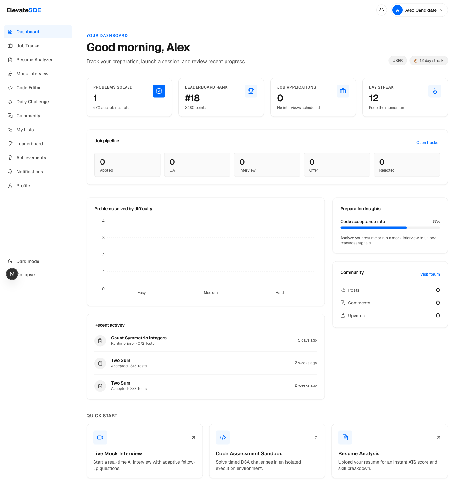
</picture>

<table>
  <tr>
    <td width="50%">
      <picture>
        <source media="(prefers-color-scheme: dark)" srcset="docs/images/candidate-code-runner-dark.png">
        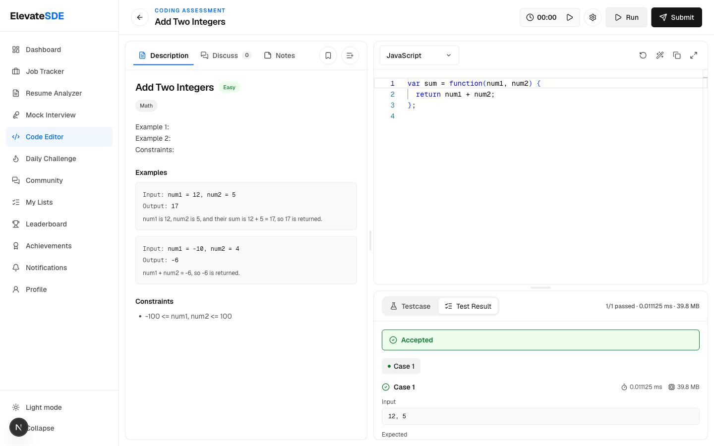
      </picture>
      <p align="center"><strong>Code runner</strong> · Monaco IDE, run against test cases, live runtime/memory</p>
    </td>
    <td width="50%">
      <picture>
        <source media="(prefers-color-scheme: dark)" srcset="docs/images/candidate-daily-dark.png">
        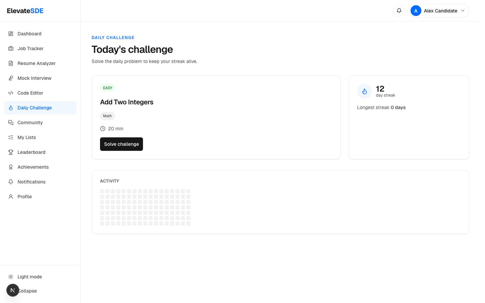
      </picture>
      <p align="center"><strong>Daily challenge & streaks</strong> · one problem a day, streak tracking</p>
    </td>
  </tr>
  <tr>
    <td width="50%">
      <picture>
        <source media="(prefers-color-scheme: dark)" srcset="docs/images/candidate-profile-dark.png">
        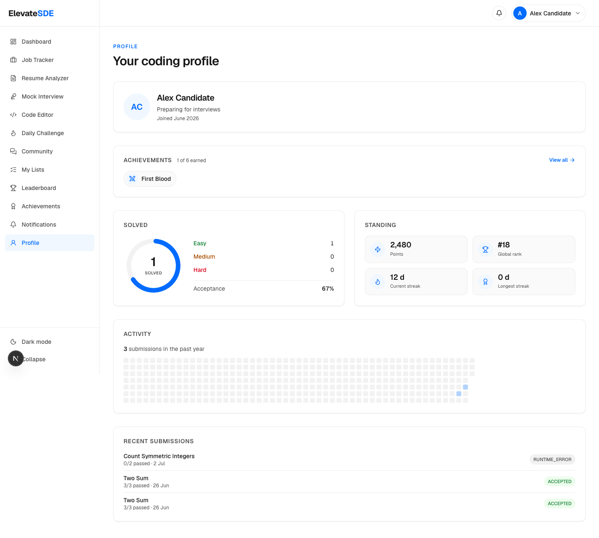
      </picture>
      <p align="center"><strong>Profile & heatmap</strong> · standing, badges, 365-day contribution grid</p>
    </td>
    <td width="50%">
      <picture>
        <source media="(prefers-color-scheme: dark)" srcset="docs/images/candidate-leaderboard-dark.png">
        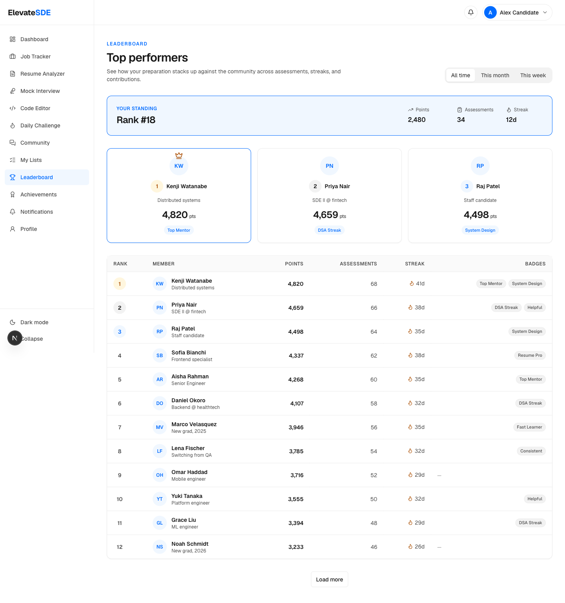
      </picture>
      <p align="center"><strong>Leaderboard</strong> · all-time / monthly / weekly rankings</p>
    </td>
  </tr>
  <tr>
    <td width="50%">
      <picture>
        <source media="(prefers-color-scheme: dark)" srcset="docs/images/candidate-achievements-dark.png">
        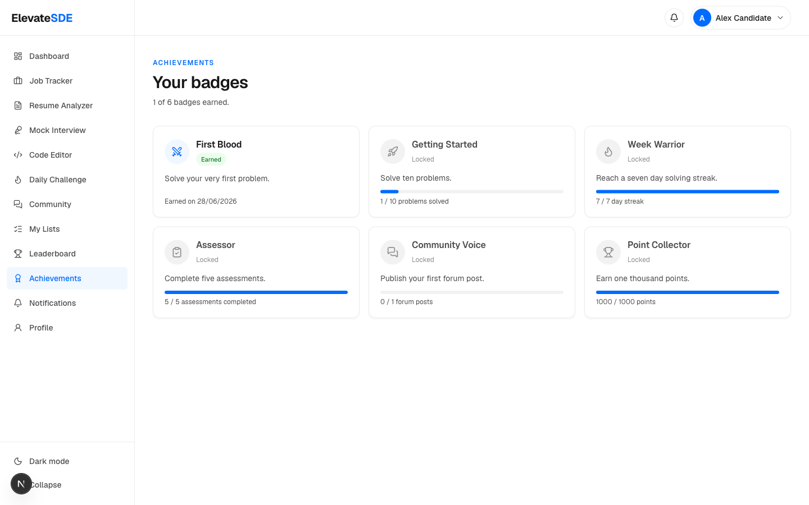
      </picture>
      <p align="center"><strong>Achievements</strong> · earned and locked badges with progress</p>
    </td>
    <td width="50%">
      <picture>
        <source media="(prefers-color-scheme: dark)" srcset="docs/images/candidate-forum-dark.png">
        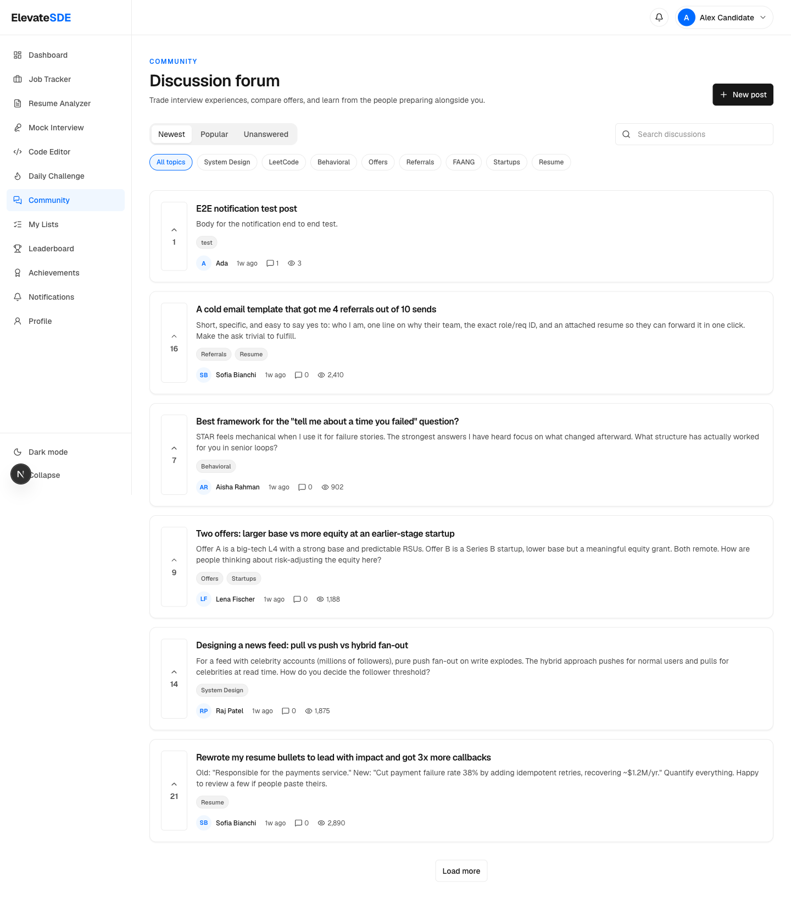
      </picture>
      <p align="center"><strong>Community forum</strong> · posts, votes, comments, topic filters</p>
    </td>
  </tr>
  <tr>
    <td width="50%">
      <picture>
        <source media="(prefers-color-scheme: dark)" srcset="docs/images/candidate-assessment-dark.png">
        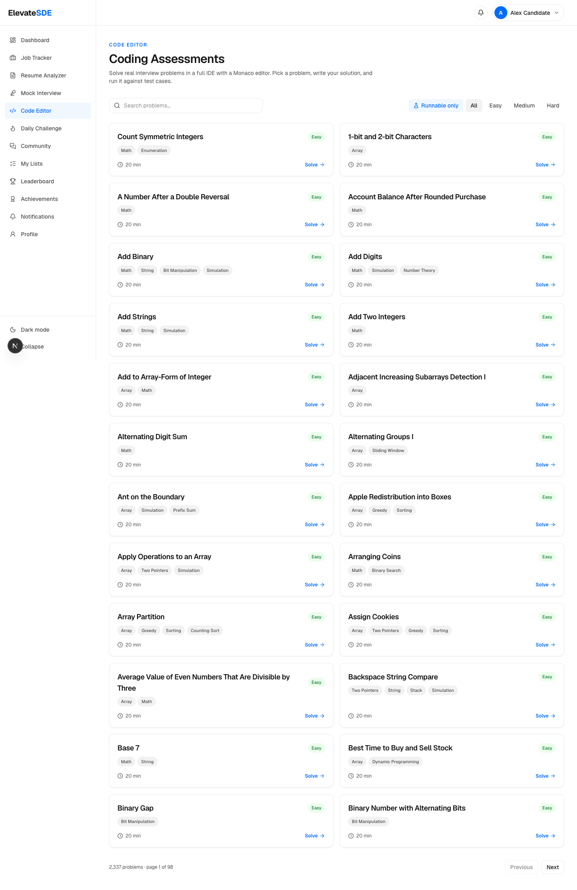
      </picture>
      <p align="center"><strong>Problem bank</strong> · 2,700+ problems, search, difficulty and runnable filters</p>
    </td>
    <td width="50%"></td>
  </tr>
</table>

### Admin backoffice

<picture>
  <source media="(prefers-color-scheme: dark)" srcset="docs/images/admin-dashboard-dark.png">
  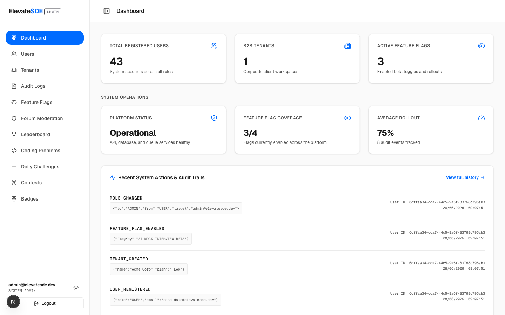
</picture>

<table>
  <tr>
    <td width="50%">
      <picture>
        <source media="(prefers-color-scheme: dark)" srcset="docs/images/admin-coding-problems-dark.png">
        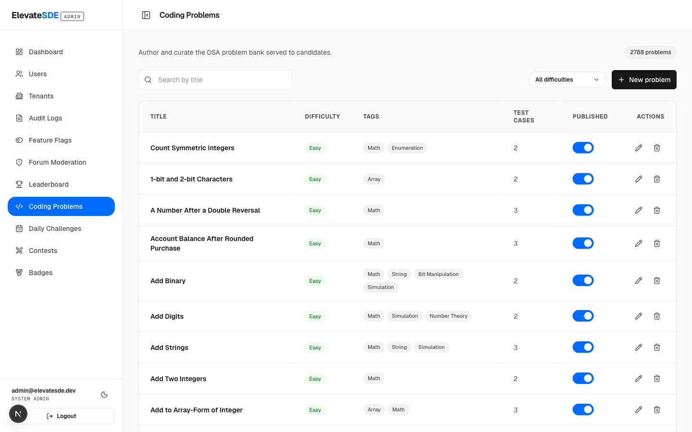
      </picture>
      <p align="center"><strong>Problem bank admin</strong> · author problems, publish, per-problem test cases</p>
    </td>
    <td width="50%">
      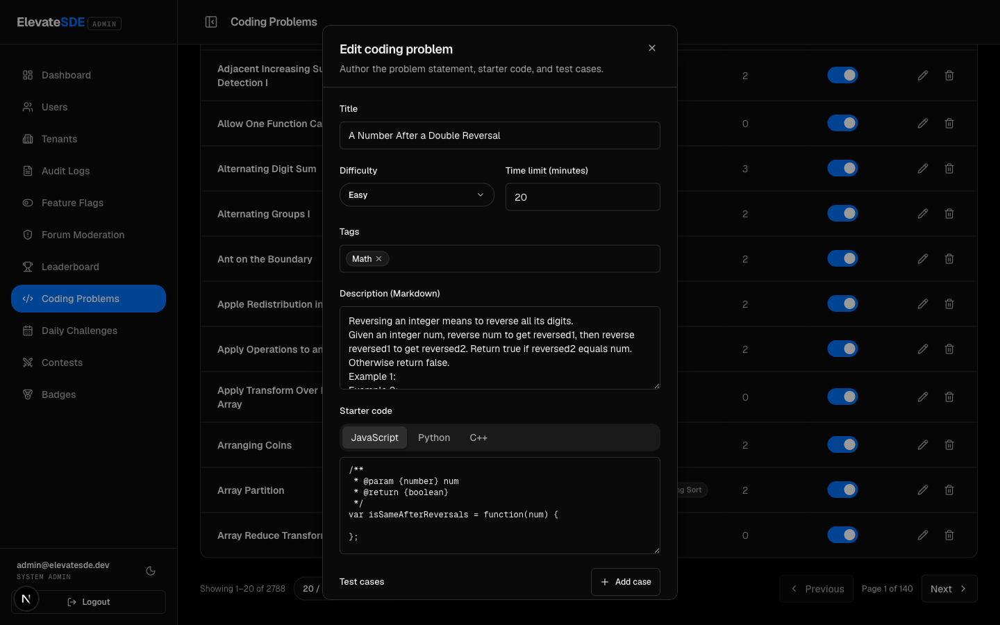
      <p align="center"><strong>Problem editor</strong> · Markdown, JS/Python/C++ starter code, test-case authoring</p>
    </td>
  </tr>
  <tr>
    <td width="50%">
      <picture>
        <source media="(prefers-color-scheme: dark)" srcset="docs/images/admin-contests-dark.png">
        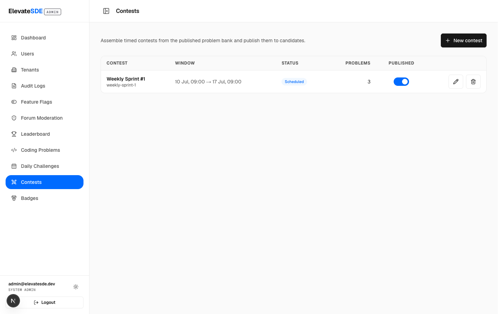
      </picture>
      <p align="center"><strong>Contests</strong> · schedule, publish, DRAFT → SCHEDULED → LIVE → ENDED</p>
    </td>
    <td width="50%">
      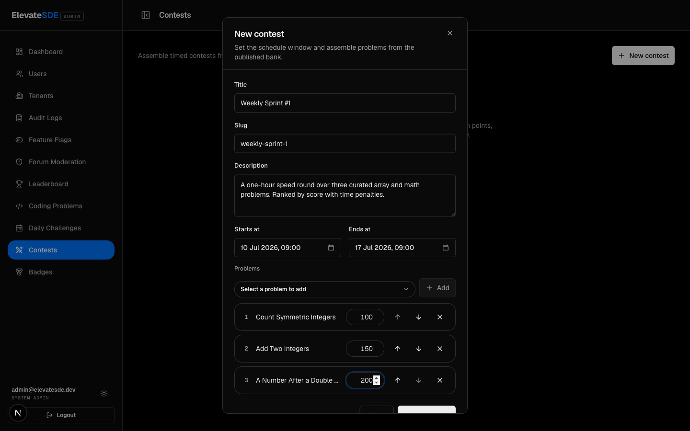
      <p align="center"><strong>Contest builder</strong> · schedule window, attach point-weighted problems</p>
    </td>
  </tr>
  <tr>
    <td width="50%">
      <picture>
        <source media="(prefers-color-scheme: dark)" srcset="docs/images/admin-daily-challenges-dark.png">
        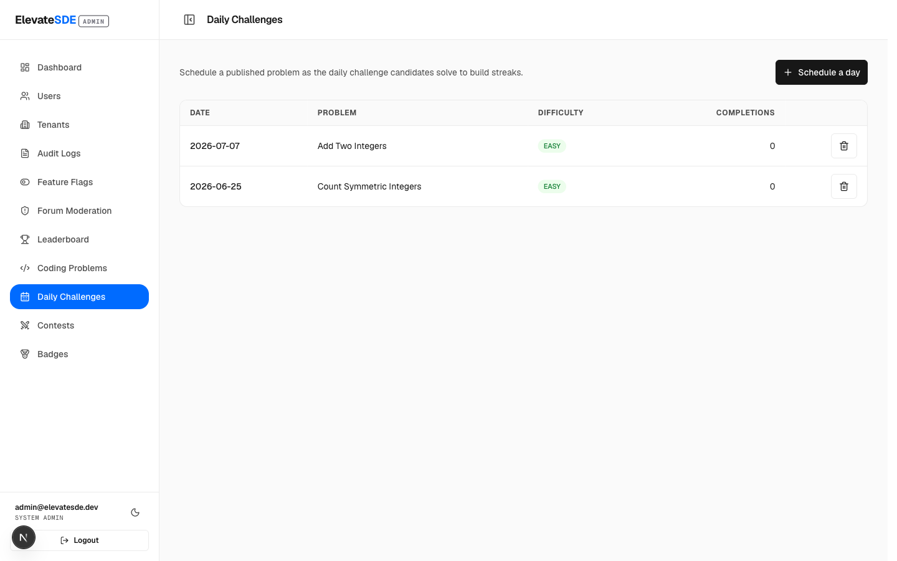
      </picture>
      <p align="center"><strong>Daily challenge scheduler</strong> · assign a problem per day, track completions</p>
    </td>
    <td width="50%"></td>
  </tr>
</table>

## Code Execution Sandbox

Candidate submissions are evaluated by the `code-runner` module in isolated Docker containers. It is **harness-based** (the candidate writes a function; a generated driver invokes it with JSON-decoded arguments) rather than stdin/stdout-based.

- **Languages:** JavaScript (`node:20-alpine`), Python (`python:3.12-alpine`), C++ (`gcc:13`, compiled with `-O2 -std=c++17`).
- **Isolation & limits:** `--network none`, read-only filesystem, `2s` per test case, `256MB` memory, `--cpus=1.0`, `--pids-limit=64`.
- **Grading:** each problem has a `comparisonMode` — `EXACT`, `UNORDERED` (multiset, order-independent), or `FLOAT_TOLERANT` (1e-6 relative tolerance).
- **Two entry points:** `POST /api/v1/assessments/run` runs **visible** cases synchronously; `POST /api/v1/assessments/submit` queues a job (BullMQ) that runs **all** cases (incl. hidden) via the `CodeExecutionProcessor`, transitioning the submission `QUEUED → RUNNING → ACCEPTED / WRONG_ANSWER / …`. Clients poll `GET /api/v1/assessments/submissions/:id`.

> **Docker must be running** for code execution. The runtime images are pulled automatically on first use (or pre-pull with `docker pull node:20-alpine python:3.12-alpine`).

## System Audit Logging & Compliance

Audit Logs are implemented to track administrative actions, mutations, and authentication occurrences across the system. We require audit logging for:

1. **Security Compliance:** Fulfilling standards such as SOC 2 and ISO 27001 by maintaining an immutable trail of administrative actions.
2. **Accountability:** Tracking details on critical mutations (such as user role adjustments, tenant upgrades, or subscription modifications).
3. **Troubleshooting & Debugging:** Enabling developers and B2B managers to reconstruct chronological sequences of events when debugging system states.

## Monorepo Workspace Structure

```text
elevatesde/
├── apps/
│   ├── web/                 (Next.js 16.2.9 Frontend - Candidate Portal, port 3001)
│   ├── api/                 (NestJS Backend - Core API, port 4400)
│   └── admin/               (Next.js 16.2.9 Frontend - Admin Backoffice, internal port 3002, served at /admin)
├── packages/
│   ├── shared-types/        (TypeScript Interfaces used across apps)
│   ├── ui/                  (Shared Tailwind components)
│   ├── eslint-config/       (Standardized linting)
│   ├── ts-config/           (Standardized TypeScript rules)
│   └── logger/              (Custom Winston + OpenTelemetry wrapper)
```

## Local Setup

The API requires a PostgreSQL database (and Redis for caching/queues). Both are described in `docker-compose.yml`, or you can point at a locally running instance.

1. **Install dependencies** (from the repo root):

   ```bash
   pnpm install
   ```

2. **Create environment files** from the provided examples:

   - `apps/api/.env` — copy from `apps/api/.env.example` and set `DATABASE_URL`, `JWT_SECRET`, `PORT` (default `4400`).
   - `apps/web/.env.local` and `apps/admin/.env.local` — copy from their `.env.example` siblings and set `NEXT_PUBLIC_API_URL` to match the API URL (default `http://localhost:4400`).

   > If port `4400` is already in use, set a free `PORT` in `apps/api/.env` and update `NEXT_PUBLIC_API_URL` in both client `.env.local` files to match.

3. **Start the database & cache** (via Docker, or use a local Postgres/Redis):

   ```bash
   docker compose up -d
   ```

4. **Apply migrations and seed demo data** (from `apps/api`):

   ```bash
   pnpm exec prisma generate
   pnpm exec prisma migrate deploy
   pnpm exec prisma db seed
   ```

   > `db seed` loads the full problem catalogue plus the runnable problem set (with harnesses, test cases, and grading metadata) and community/demo data. To reseed only the problem bank, use `pnpm run db:seed:problems`. **Code execution requires Docker running** (see [Code Execution Sandbox](#code-execution-sandbox)).

5. **Run the apps**:

   ```bash
   pnpm -w run dev:all
   ```

## Dashboards

| Surface                  | URL                                            | Access                 |
| ------------------------ | ---------------------------------------------- | ---------------------- |
| Candidate dashboard      | `http://localhost:3001/dashboard`              | Any authenticated user |
| Coding assessments       | `http://localhost:3001/dashboard/assessment`   | Any authenticated user |
| Daily challenge & streak | `http://localhost:3001/dashboard/daily`        | Any authenticated user |
| Profile & heatmap        | `http://localhost:3001/dashboard/profile`      | Any authenticated user |
| Leaderboard              | `http://localhost:3001/dashboard/leaderboard`  | Any authenticated user |
| Achievements & badges    | `http://localhost:3001/dashboard/achievements` | Any authenticated user |
| Community forum          | `http://localhost:3001/dashboard/forum`        | Any authenticated user |
| Notifications            | `http://localhost:3001/dashboard/notifications`| Any authenticated user |
| Organization dashboard   | `http://localhost:3001/dashboard/org`          | `TENANT_ADMIN` only    |
| Super-Admin backoffice   | `http://localhost:3001/admin`                  | `ADMIN` only           |
| Coding problem bank      | `http://localhost:3001/admin/coding-problems`  | `ADMIN` only           |
| Daily challenge schedule | `http://localhost:3001/admin/daily-challenges` | `ADMIN` only           |
| Coding contests          | `http://localhost:3001/admin/contests`         | `ADMIN` only           |
| Badge management         | `http://localhost:3001/admin/badges`           | `ADMIN` only           |

> Everything is reached through the single web origin on **port 3001**. The backoffice is a separate Next.js app (`apps/admin`) that runs internally on port `3002` with `basePath: '/admin'`; `apps/web/next.config.ts` rewrites `/admin/:path*` to it, so you always visit `localhost:3001/admin` (a reverse proxy does the same under one domain in production). Do not open port `3002` directly.

Seeded demo logins (all use the password `Password123!`):

| Email                      | Role           |
| -------------------------- | -------------- |
| `admin@elevatesde.dev`     | `ADMIN`        |
| `org@elevatesde.dev`       | `TENANT_ADMIN` |
| `candidate@elevatesde.dev` | `USER`         |

Most surfaces are backed by live, user-scoped API endpoints: the candidate dashboard, coding assessments + execution, daily challenge & streaks, profile & submission heatmap, job tracker, community forum, leaderboard, achievements/badges (`/api/v1/achievements`), notifications (`/api/v1/notifications`), and the organization dashboard, plus the backoffice (`/api/v1/admin/*`, including the coding problem bank, daily-challenge scheduling, contest management, badge management, forum moderation, and leaderboard management). Per-problem community and curation endpoints are also live via the `problem-social` module: problem discussions with comments/upvotes (`/api/v1/problems/:id/discussions`, `/api/v1/discussions/*`), bookmarks (`/api/v1/problems/:id/bookmark`, `/api/v1/me/bookmarks`), private notes (`/api/v1/problems/:id/note`), and custom problem collections (`/api/v1/me/lists*`). The spaced-repetition `review` module (`/api/v1/review/due`, `/api/v1/review/:problemId/grade`) is live at the API layer, with its candidate UI still to come. Only the **AI mock interview** and **resume analyzer** surfaces remain client-side mocks (in-browser engines), pending their domain models.

## Common Commands

```bash
pnpm -w run dev:all       # API + Web Client + Admin Backoffice
pnpm -w run dev:clients   # Web Client + Admin Backoffice only
pnpm -w run type-check    # TypeScript checks across the workspace
pnpm -w run lint          # ESLint across the workspace
pnpm -w run build         # Build all apps and packages
```
