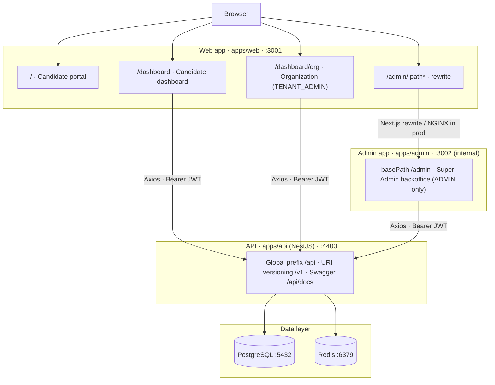

# ElevateSDE: Enterprise AI Interview Preparation Platform

## Vision

A comprehensive, enterprise-grade multi-tenant platform where software engineering candidates can prepare for interviews, take timed assessments, attend real-time AI-driven mock interviews, and receive personalized learning plans.

This platform is built as a SaaS product, supporting individual users as well as B2B tenants (companies purchasing seats for their employees).

---

## Tech Stack

### Frontend

- **Core:** Next.js 16.2.9 (App Router, Turbopack)
- **Architecture:** React Server Components (RSC), Suspense, Error Boundaries, Optimistic Updates
- **Styling & UI:** Tailwind CSS (v4) with custom, in-house components in `packages/ui` (no Shadcn). Theme is driven by CSS custom properties with light/dark modes; no gradients or glassmorphism.
- **Icons & Charts:** `lucide-react` for icons, `recharts` for data visualisation (e.g. seat gauges, performance charts).
- **State Management:** Zustand (Client State), TanStack Query / React Query (Server State — planned)
- **Forms & Validation:** React Hook Form, Zod (planned)
- **Data Fetching & Real-time:** Axios, Socket.io Client
- **Performance:** TanStack Virtual (Infinite scrolling for leaderboards/discussions — planned)
- **Testing:** Playwright (E2E), Jest + React Testing Library (Unit)

### Backend

- **Core:** NestJS, TypeScript
- **Database & ORM:** PostgreSQL, Prisma ORM, `pgvector` (for AI similarity search)
- **Caching & Queues:** Redis, BullMQ
- **Real-time & Events:** Socket.io, Event-Driven Architecture (Node.js EventEmitter)
- **Authentication:** Passport.js, JWT (Access/Refresh rotation)
- **Monetization & Billing:** Stripe API (Webhooks, Subscriptions, Multi-tenant billing)

### Observability & Infrastructure

- **Telemetry & Tracing:** OpenTelemetry (End-to-End request tracing)
- **Monitoring:** Prometheus, Grafana
- **Error Tracking:** Sentry
- **Cloud Infrastructure:** AWS S3 (Storage), CloudFront (CDN), AWS SES (Emails)
- **DevOps:** Docker, Docker Compose, NGINX (Reverse Proxy)
- **CI/CD:** GitHub Actions (Lint -> Unit Tests -> E2E -> Build -> Docker -> Deploy)

### AI Orchestration

- **Engine:** LangChain
- **Models:** OpenAI, Claude, Gemini API integrations

---

## Monorepo Workspace Structure (Turborepo)

```text
elevatesde/
├── apps/
│   ├── web/                 (Next.js 16.2.9 Frontend — Candidate Portal, port 3001)
│   ├── api/                 (NestJS Backend — Core API, port 4400)
│   └── admin/               (Internal Super-Admin Dashboard, internal port 3002, served at /admin)
│
├── packages/
│   ├── shared-types/        (TypeScript Interfaces used across apps)
│   ├── ui/                  (Shared custom Tailwind components)
│   ├── eslint-config/       (Standardized linting)
│   ├── ts-config/           (Standardized TypeScript rules)
│   └── logger/              (Custom Winston + OpenTelemetry wrapper)
│
├── turbo.json
└── package.json

```

---

## Application Topology & Routing

The platform exposes a **single public origin** to users; the admin backoffice is a separate deployable that sits behind the same origin.



- **Single entry point:** users only ever visit the web origin (`http://localhost:3001`). The candidate portal and dashboards are served directly; `/admin/*` is transparently forwarded to the admin app.
- **Why two apps:** the Super-Admin backoffice is an independently deployable application with its own auth/middleware and a hard security boundary. It runs on its own internal port (`3002`) with `basePath: '/admin'`.
- **Dev proxy:** `apps/web/next.config.ts` rewrites `/admin/:path*` → `http://localhost:3002/admin/:path*`. In production a reverse proxy (NGINX) performs the equivalent routing under one domain.
- **Local ports:** web `3001`, admin (internal) `3002`, API `4400` (configurable via `PORT`), PostgreSQL `5432`, Redis `6379`. Clients read the API URL from `NEXT_PUBLIC_API_URL`.

### Dashboard Surfaces

| Surface                  | Route (via web origin)    | Access                 |
| ------------------------ | ------------------------- | ---------------------- |
| Candidate dashboard      | `/dashboard`              | Any authenticated user |
| Coding assessments       | `/dashboard/assessment`   | Any authenticated user |
| Daily challenge          | `/dashboard/daily`        | Any authenticated user |
| Profile & heatmap        | `/dashboard/profile`      | Any authenticated user |
| Job tracker              | `/dashboard/job-tracker`  | Any authenticated user |
| Organization dashboard   | `/dashboard/org`          | `TENANT_ADMIN`         |
| Super-Admin backoffice   | `/admin`                  | `ADMIN`                |
| Coding problem bank      | `/admin/coding-problems`  | `ADMIN`                |
| Daily challenge schedule | `/admin/daily-challenges` | `ADMIN`                |
| Coding contests          | `/admin/contests`         | `ADMIN`                |

The backoffice consumes live `/api/v1/admin/*` endpoints (including the coding problem bank, daily-challenge scheduling, contest management, forum moderation, and leaderboard management). The candidate-facing surfaces are likewise live and user-scoped: the dashboard (`/api/v1/users/me/dashboard-stats`), coding assessments + execution (`/api/v1/problems`, `/api/v1/assessments/run` + `/submit`), daily challenge & streaks (`/api/v1/daily-challenge/today` + `/streak`), profile & submission heatmap (`/api/v1/users/me` + `/submission-heatmap`), job tracker (`/api/v1/job-applications`), community forum (`/api/v1/forum/*`), leaderboard (`/api/v1/leaderboard`), and the organization dashboard (`/api/v1/org/*`). Only the **AI mock interview** and **resume analyzer** surfaces remain backed by typed client-side Zustand stores (in-browser engines) until their domain models are implemented.

---

## Domain-Driven Design (DDD) Backend Architecture

Instead of grouping by framework features (controllers/services), the API is structured by business domains. Current domain modules include `users`, `auth`, `audit-log`, `feature-flag`, `admin`, `organization` (tenant/seat/invitation management), `job-application` (the candidate job tracker), `problem` and `code-runner` (the coding assessment bank and Dockerized execution sandbox), `daily-challenge` (daily problems + streaks), `dashboard` (aggregated candidate stats), `forum` and `leaderboard` (the community discussion board and rankings), `achievement` (badge criteria + user badge awards, plus admin badge management), `notification` (the in-app notification center and per-type preferences), `problem-social` (per-problem discussions with comments/upvotes plus personal bookmarks, private notes, and custom problem collections), `review` (SM-2 style spaced-repetition scheduling over solved problems), `contest` (admin-assembled timed competitions over the problem bank), and `queues` (the shared BullMQ root that owns async job processing), each following the layered template below.

### Example: Users Domain

```text
apps/api/src/modules/users/
├── domain/
│   ├── entities/            (Core business entities with private constructors & factories)
│   │   └── user.ts
│   └── interfaces/          (Abstract repository contracts)
│       └── users-repository.interface.ts
│
├── application/
│   └── users.service.ts     (Application services/orchestration)
│
├── infrastructure/
│   ├── mappers/             (Translates between database rows and domain entities)
│   │   └── user.mapper.ts
│   └── repositories/        (Prisma concrete database implementations)
│       └── users.repository.ts
│
└── presentation/
    ├── controllers/         (API endpoints)
    │   └── users.controller.ts
    ├── mappers/             (Translates between domain entities and response DTOs)
    │   └── user-presentation.mapper.ts
    └── dtos/                (Request/Response validation DTOs)
        └── user-response.dto.ts
```

### API Versioning & Documentation

- Versioning enabled globally via `app.enableVersioning()` in NestJS.
- Endpoints prefixed: `/api/v1/users`, `/api/v2/assessments`.
- Fully documented using Swagger/OpenAPI.

---

## Core Database Schema & Multi-Tenancy

The Prisma models and their relationships (source of truth: `apps/api/prisma/schema.prisma`). `User` is the central aggregate; `Problem` anchors all coding/assessment data. `tenantId` is nullable throughout for B2C users and global content.

```mermaid
classDiagram
    class Tenant {
        +String id
        +String name
        +String subscriptionPlan
        +Int seatLimit
        +String stripeCustomerId
    }
    class User {
        +String id
        +String tenantId
        +String email
        +UserRole role
    }
    class UserStats {
        +String userId
        +Int points
        +Int weeklyPoints
        +Int monthlyPoints
        +Int streakDays
        +Int longestStreak
        +Date lastActiveDate
    }
    class RefreshToken {
        +String token
        +DateTime expiresAt
    }
    class Invitation {
        +String email
        +InvitationStatus status
        +DateTime expiresAt
    }
    class Problem {
        +String id
        +String slug
        +AssessmentDifficulty difficulty
        +Json starterCode
        +Json harness
        +ComparisonMode comparisonMode
        +Boolean isPublished
    }
    class ProblemTestCase {
        +Int ordinal
        +String input
        +String expectedOutput
        +Boolean isHidden
    }
    class Submission {
        +AssessmentLanguage language
        +SubmissionStatus status
        +Int passedCount
        +Int totalCount
        +Float totalRuntimeMs
        +Int peakMemoryKb
    }
    class SubmissionResult {
        +String label
        +TestCaseResultStatus status
        +Float runtimeMs
        +Boolean isHidden
    }
    class DailyChallenge {
        +Date challengeDate
        +String tenantId
    }
    class DailyChallengeCompletion {
        +String submissionId
        +DateTime completedAt
    }
    class Contest {
        +String slug
        +DateTime startsAt
        +DateTime endsAt
        +ContestStatus status
    }
    class ContestProblem {
        +Int ordinal
        +Int points
    }
    class Badge {
        +String key
        +BadgeCriteriaType criteriaType
        +Int threshold
    }
    class UserBadge {
        +DateTime awardedAt
    }
    class Notification {
        +NotificationType type
        +String title
        +DateTime readAt
    }
    class NotificationPreference {
        +NotificationType type
        +Boolean inAppEnabled
    }
    class ReviewItem {
        +Float ease
        +Int intervalDays
        +Int repetitions
        +DateTime dueAt
    }
    class JobApplication {
        +String company
        +JobApplicationStatus status
        +Int boardPosition
    }
    class ForumPost {
        +String title
        +ForumPostStatus status
        +Int viewCount
    }
    class ForumComment
    class ProblemDiscussion {
        +String title
    }
    class Bookmark
    class ProblemNote
    class ProblemList {
        +String name
        +Boolean isPublic
    }
    class ProblemListItem {
        +Int ordinal
    }
    class AuditLog {
        +String action
        +Json metadata
    }
    class FeatureFlag {
        +String flagKey
        +Boolean isEnabled
        +Int percentageRollout
    }

    Tenant "1" o-- "*" User
    Tenant "1" o-- "*" Invitation
    User "1" --> "0..1" UserStats
    User "1" o-- "*" RefreshToken
    User "1" o-- "*" Submission
    User "1" o-- "*" JobApplication
    User "1" o-- "*" ForumPost
    User "1" o-- "*" ProblemDiscussion
    User "1" o-- "*" Bookmark
    User "1" o-- "*" ProblemNote
    User "1" o-- "*" ProblemList
    User "1" o-- "*" ReviewItem
    User "1" o-- "*" Notification
    User "1" o-- "*" NotificationPreference
    User "1" o-- "*" UserBadge
    User "1" o-- "*" AuditLog
    User "1" o-- "*" DailyChallengeCompletion
    Problem "1" o-- "*" ProblemTestCase
    Problem "1" o-- "*" Submission
    Problem "1" o-- "*" DailyChallenge
    Problem "1" o-- "*" ContestProblem
    Problem "1" o-- "*" ProblemDiscussion
    Problem "1" o-- "*" Bookmark
    Problem "1" o-- "*" ProblemNote
    Problem "1" o-- "*" ReviewItem
    Submission "1" o-- "*" SubmissionResult
    DailyChallenge "1" o-- "*" DailyChallengeCompletion
    Contest "1" o-- "*" ContestProblem
    Badge "1" o-- "*" UserBadge
    ForumPost "1" o-- "*" ForumComment
    ProblemList "1" o-- "*" ProblemListItem
    Problem "1" o-- "*" ProblemListItem
```



> Composite-key join tables that back upvote counts and per-viewer state — `ForumPostVote`, `ForumCommentVote`, `ProblemDiscussionVote`, `ProblemDiscussionCommentVote` — are omitted from the diagram for clarity; each is a `(parentId, userId)` pair. `UserBadge` (`@@unique([userId, badgeId])`) is the many-to-many join between `User` and `Badge`.

**Tenants, Users & Auth**

- `Tenant` (B2B Companies): `id`, `name`, `stripeCustomerId`, `subscriptionPlan`
- `User`: `id`, `tenantId` (Nullable for B2C), `email`, `role`, `createdAt`
- `RefreshToken`: `id`, `userId`, hashed token + expiry (backs JWT refresh rotation)
- `Invitation`: `id`, `tenantId`, `email`, `token`, `status`, `expiresAt` (tenant seat invitations)

**Audit & Telemetry**

- `AuditLog`: `id`, `userId`, `action` (e.g., "ROLE_CHANGED"), `metadata` (JSON), `createdAt`
- `FeatureFlag`: `id`, `flagKey` (e.g., "AI_MOCK_INTERVIEW_BETA"), `isEnabled`, `percentageRollout`

**Coding Assessments & Execution**

- `Problem`: the coding assessment definition (replaces the legacy `Question` model) — `slug`, `difficulty`, `description`, `constraints`, `tags`, `starterCode`, `examples`, `functionName`, `harness` (paramTypes/returnType/cpp signature), `comparisonMode` (EXACT / UNORDERED / FLOAT_TOLERANT), `timeLimitMinutes`, `isPublished`
- `ProblemTestCase`: `id`, `problemId`, `ordinal`, `input`, `expectedOutput`, `isHidden`
- `Submission` / `SubmissionResult`: a submission attempt (status, passed count, runtime, memory) and its per-test-case results produced by the sandbox
- `Contest` / `ContestProblem`: an admin-assembled timed competition (`slug`, `title`, `description`, `startsAt`, `endsAt`, `status ContestStatus` — DRAFT / SCHEDULED / LIVE / ENDED, `tenantId`) and its ordered, points-weighted problems (`@@unique([contestId, problemId])`). Candidate participation/submission tables and the BullMQ status scheduler are pending.
- `MockInterview` _(planned)_: `id`, `userId`, `transcript` (JSONB), `aiFeedback`, `overallScore`
- `Resume` _(planned)_: `id`, `userId`, `s3FileUrl`, `atsScore`, `parsedSkills`

**Gamification, Community & Tracking**

- `DailyChallenge`: `id`, `challengeDate`, `problemId`, `tenantId` (the problem assigned for a given day)
- `DailyChallengeCompletion`: `id`, `userId`, `dailyChallengeId`, `submissionId`, `completedAt` (drives streak calculation)
- `UserStats`: `userId`, `points`, `monthlyPoints`, `weeklyPoints`, `assessmentsCompleted`, `badges`, `streakDays`, `longestStreak`, `lastActiveDate` (powers leaderboard timeframe rankings, profile standing, and streaks)
- `ForumPost`: `id`, `userId`, `title`, `body`, `tags`, `status` (`ForumPostStatus` enum: PUBLISHED, FLAGGED, REMOVED), `viewCount`, `createdAt`, `updatedAt`
- `ForumComment`: `id`, `postId`, `userId`, `body`, `createdAt`, `updatedAt`
- `ForumPostVote` / `ForumCommentVote`: composite-key join tables (`postId`/`commentId` + `userId`) backing upvote counts and per-viewer `hasUpvoted`
- `ForumReport`: `id`, `postId`, `reporterId`, `reason`, `createdAt` (drives the backoffice moderation queue)
- `ProblemDiscussion` / `ProblemDiscussionComment`: per-problem discussion threads (`problemId`, `userId`, `title`/`body`) and their comments, mirroring the forum post/comment shape scoped to a `Problem`
- `ProblemDiscussionVote` / `ProblemDiscussionCommentVote`: composite-key join tables backing discussion/comment upvote counts and per-viewer `hasUpvoted`
- `Bookmark`: `id`, `userId`, `problemId`, `createdAt` (`@@unique([userId, problemId])`) — a user's saved problems
- `ProblemNote`: `id`, `userId`, `problemId`, `body` (`@@unique([userId, problemId])`) — one private note per user per problem
- `ProblemList` / `ProblemListItem`: user-owned custom problem collections (`name`, `isPublic`) and their ordered members (`ordinal`, `@@unique([listId, problemId])`)
- `JobApplication`: `id`, `userId`, `company`, `role`, `status` (`JobApplicationStatus` enum: APPLIED, OA, INTERVIEW, OFFER, REJECTED), `salaryRange`, `jobDescriptionUrl`, `interviewDate`, `boardPosition` (Kanban ordering), `createdAt`, `updatedAt`
- `Badge` / `UserBadge`: a badge definition (`key`, `name`, `icon`, `criteriaType` — `BadgeCriteriaType` enum: PROBLEMS_SOLVED / STREAK_DAYS / ASSESSMENTS_COMPLETED / FORUM_POSTS / POINTS — `threshold`, `isActive`, `tenantId`) and the many-to-many award join to `User` (`@@unique([userId, badgeId])`, `awardedAt`)
- `Notification` / `NotificationPreference`: an in-app notification (`type` — `NotificationType` enum: BADGE_AWARDED / STREAK_MILESTONE / FORUM_REPLY / FORUM_UPVOTE / SUBMISSION_ACCEPTED / SYSTEM — `title`, `body`, `linkUrl`, `metadata`, `readAt`) and a per-user, per-type `inAppEnabled` toggle (`@@unique([userId, type])`)
- `ReviewItem`: an SM-2 spaced-repetition entry per user+problem (`ease`, `intervalDays`, `repetitions`, `dueAt`, `lastReviewedAt`, `@@unique([userId, problemId])`) driving the `review` module's "due today" queue

---

## Advanced Systems & Workflows

### 1. Event-Driven Architecture

Business logic is decoupled using events.

- **Action:** User completes an assessment.
- **Event:** `AssessmentCompletedEvent` is fired.
- **Listeners:** \* `NotificationListener`: Sends email via AWS SES.
- `AnalyticsListener`: Updates the user's learning dashboard.
- `LeaderboardListener`: Recalculates Redis sorted sets.

### 2. Distributed Queues (BullMQ + Redis)

Resource-intensive tasks are offloaded from the main event loop. The `queues` module owns the
BullMQ root connection (Redis from `REDIS_URL`, namespaced under the `elevatesde` prefix) and
exposes typed producer ports (e.g. `ICodeExecutionQueue`); each owning domain registers its own
queue and processor. Queue names for `resume` and `email` are reserved for the follow-up modules.

- **Code Execution Engine** _(async on BullMQ — implemented)_: Secure, isolated Docker environment (the `code-runner` module) for evaluating candidate DSA submissions against test cases, with per-language drivers (JavaScript, Python, C++), timeouts, and memory limits. The model is **harness-based**: each `Problem` stores a `harness` (param/return types + C++ signature) and a generated driver invokes the candidate's function with JSON-decoded arguments, then grades output by the problem's `comparisonMode` (`EXACT`, `UNORDERED`, or `FLOAT_TOLERANT`). `POST /assessments/submit` persists a `QUEUED` submission, enqueues a job (`202` + `submissionId`), and a `CodeExecutionProcessor` worker transitions it `QUEUED → RUNNING → ACCEPTED/WRONG_ANSWER/…`; clients poll `GET /assessments/submissions/:id`. Jobs retry with exponential backoff, and an exhausted-retry handler marks the submission failed so it never stalls. The quick `POST /assessments/run` (visible cases only) remains synchronous.
- **Resume Processing** _(pending)_: Extracts text from S3 documents, parses via LLM, and calculates ATS score.

### 3. Gamification & Streaks _(implemented)_

Daily engagement is driven by the `daily-challenge` module and the `UserStats` aggregate.

- **Daily challenge:** admins assign a `Problem` to a date (`DailyChallenge`); candidates fetch it via `GET /daily-challenge/today` and solve it like any assessment.
- **Streaks:** completing the day's challenge writes a `DailyChallengeCompletion`, advancing `UserStats.streakDays` (and `longestStreak`); `GET /daily-challenge/streak` returns current/longest streak plus calendar cells. A streak-celebration modal fires on completion.
- **Submission heatmap:** `GET /users/me/submission-heatmap` returns a GitHub-style 365-day contribution grid rendered on the profile page (`/dashboard/profile`).

### 4. Achievements & Badges _(implemented)_

The `achievement` module turns `UserStats` counters into unlockable badges.

- **Badge criteria:** each `Badge` declares a `criteriaType` (`PROBLEMS_SOLVED`, `STREAK_DAYS`, `ASSESSMENTS_COMPLETED`, `FORUM_POSTS`, `POINTS`) and a `threshold`; admins define and toggle them via `/api/v1/admin/badges` (backoffice `/admin/badges`).
- **Candidate view:** `GET /api/v1/achievements` returns earned and locked badges with per-badge progress, rendered as cards on `/dashboard/achievements` and summarised on the profile.

### 5. In-App Notifications _(implemented)_

The `notification` module delivers a bell + notification center (`/dashboard/notifications`).

- **Types:** `BADGE_AWARDED`, `STREAK_MILESTONE`, `FORUM_REPLY`, `FORUM_UPVOTE`, `SUBMISSION_ACCEPTED`, `SYSTEM`, emitted by domain events (e.g. a badge award or an accepted submission).
- **Delivery & preferences:** `GET /api/v1/notifications` (list + unread count, polled ~45s by the client), with per-user, per-type `inAppEnabled` toggles via `NotificationPreference`.

### 6. Spaced Repetition _(API implemented; candidate UI pending)_

The `review` module schedules solved problems for re-practice using an SM-2 style algorithm.

- **Scheduling:** each `ReviewItem` tracks `ease`, `intervalDays`, `repetitions`, and `dueAt`; grading a review (`POST /api/v1/review/:problemId/grade`) advances the interval.
- **Queue:** `GET /api/v1/review/due` returns the problems due today. The candidate-facing "due today" surface is still to be built.

### 7. AI Mock Interviews (RAG Implementation)

- When a user submits an answer (text or transcribed audio), the backend converts the response into an embedding.
- `pgvector` performs a cosine similarity search against the `idealSolutionEmbedding`.
- LangChain orchestrates the comparison to generate contextual, accurate feedback and a dynamic follow-up question.

### 8. CI/CD Pipeline (GitHub Actions)

1. **PR Created:** Triggers pipeline.
2. **Lint & Format:** Checks `eslint` and `prettier` rules.
3. **Unit Tests:** Runs Jest for core use-cases.
4. **E2E Tests:** Runs Playwright against a transient staging environment.
5. **Build:** Compiles Next.js (Turbopack) and NestJS applications.
6. **Containerize:** Builds Docker images and pushes to AWS ECR / Docker Hub.
7. **Deploy:** Updates production services.

---

## Phased Execution Plan

- **Phase 1 (Core Foundations):** Monorepo setup, Auth, Users, RBAC, Basic Questions, Next.js Dashboard.
- **Phase 2 (Asynchronous & Real-time):** Redis, BullMQ, WebSockets, Notifications, Job Tracker.
- **Phase 3 (Enterprise & AI):** Multi-tenancy, Stripe Subscriptions, AI Resume Analyzer, LangChain integration.
- **Phase 4 (Advanced Systems):** pgvector RAG _(pending)_, Dockerized Code Execution Engine _(done)_, Discussion Forums _(done)_, Leaderboards _(done)_, Gamification & Streaks — daily challenges, profile, submission heatmap _(done)_, Achievements & Badges _(done)_, In-App Notifications _(done)_, Problem Discussions + Bookmarks/Notes/Lists _(done)_, Spaced Repetition — API _(done)_; candidate UI _(pending)_, Coding Contests — admin builder _(done)_; candidate register/submit/standings + status scheduler _(pending)_.
- **Phase 5 (Production Readiness):** OpenTelemetry, Sentry, Swagger Docs, Feature Flags, Audit Logging, CI/CD pipelines.
